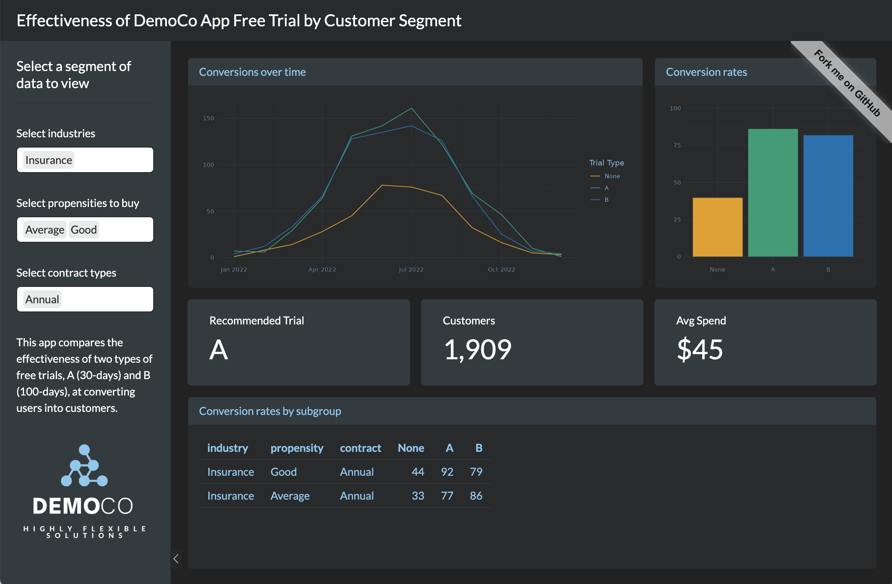
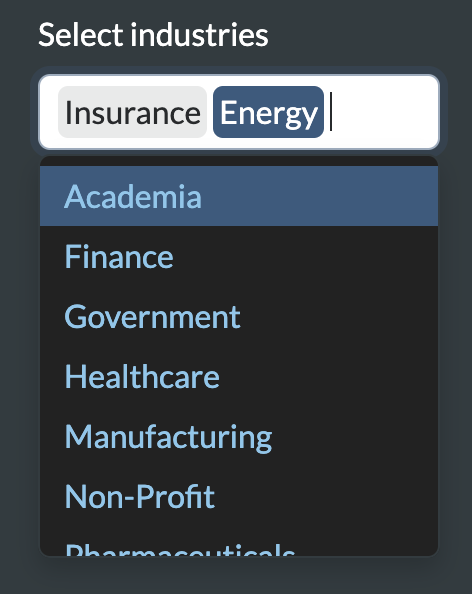
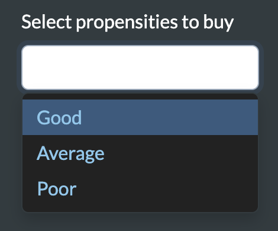
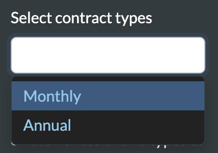

The Free Trial by Customer Segment app compares the effectiveness of two types of free trials at converting users into customers at a fictitious company:

* Free Trial A lasts 30 days
* Free Trial B lasts 100 days

The app allows decisions makers to explore various segments of customer data in real time, so they can quickly decide which free trial to adopt and under which circumstances. When a decision maker wants to look at the data in a new way, they don't need to wait to meet with their Analysts, they simply click a button.

- [View the app](https://colorado.posit.co/rsc/Free-Trial-App/) on Posit Connect
- [Play with the code](https://posit.cloud/content/6716482) on Posit Cloud


## To use the app

To use the app:

1. **Visit the app [here](https://colorado.posit.co/rsc/Free-Trial-App/).** The app is hosted on [Posit Connect](https://posit.co/products/enterprise/connect/), a hosting platform for data driven content. You can use Posit Connect to publish models, reports, etc. securely within your enterprise; or to deploy data products to your customers and manage access.

2. **Select a combination of industries to view**. Type in one or more industry names, or select industries from the drop down menu. The app will adjust to focus only on results for customers from these industries. Leave this field blank to focus on all industries.

    
    
3. **Select a propensity to buy**. DemoCo, the fictitious company who sponsored the app, divides potential customers into three categories:

    1. Good - likely to buy
    2. Average - neither likely nor unlikely to buy
    3. Poor - unlikely to buy
    
    The app will adjust to focus on results for the selected category or categories of potential customers. Leave this field blank to focus on all customers.

    
    
4. **Select a contract type.** The app will adjust to focus on results for customers who sign an annual contract, or a monthly contract. Leave this field blank to include both types of contracts.

    

# To build a similar app

The Free Trial by Customer Segment app is written in R with the [Shiny](https://shiny.posit.co/) package. Shiny makes it easy to create an interactive web app with only R code: you do not need to know HTML, CSS, JavaScript, or any web development skills. (Click here to learn about [Shiny for Python](https://shiny.posit.co/py/)).

[This tutorial](https://shiny.posit.co/getstarted.html) explains how to write a basic web app with Shiny. Like all Shiny apps, the Free Trial by Customer Segment app is composed of:

1. A user interface that collects input values and displays outputs:

    ```r
    # Define the Shiny UI layout
    ui <- page_sidebar(
      # Everything that appears in the UI
    )
    ```

2. A server function that tells R how to build outputs from input values:

    ```r
    # Define the Shiny server function
    server <- function(input, output) {
      # A list of definitions for outputs and intermediate objects, 
      # as well as code to run to create those objects
    }
    ```

3. And a call to `shinyApp()`, which brings the user interface and server function together.

    ```r
    # Create the Shiny app
    shinyApp(ui = ui, server = server)
    ```

### Notable features

There are a couple unique things about the Traveling Salesperson Planner app:

1. It [uses a theme from the bslib package](https://rstudio.github.io/bslib/articles/theming/index.html) to make the app look more visually appealing.

    ```r
    # Set CSS theme
    theme = bs_theme(bootswatch = "darkly", 
                     bg = "#222222", 
                     fg = "#86C7ED", 
                     success ="#86C7ED"),
    ```

2. It uses the [thematic](https://rstudio.github.io/thematic/) package to ensure that the plots that appear within the app use the same bslib theme. These works because the plots are made with [ggplot2](https://ggplot2.tidyverse.org/), a package that implements the [grammar of graphics](https://towardsdatascience.com/a-comprehensive-guide-to-the-grammar-of-graphics-for-effective-visualization-of-multi-dimensional-1f92b4ed4149) within R.

    ```r
    # Set the default theme for ggplot2 plots
    ggplot2::theme_set(ggplot2::theme_minimal())
    
    # Apply the CSS used by the Shiny app to the ggplot2 plots
    thematic_shiny()
    ```
