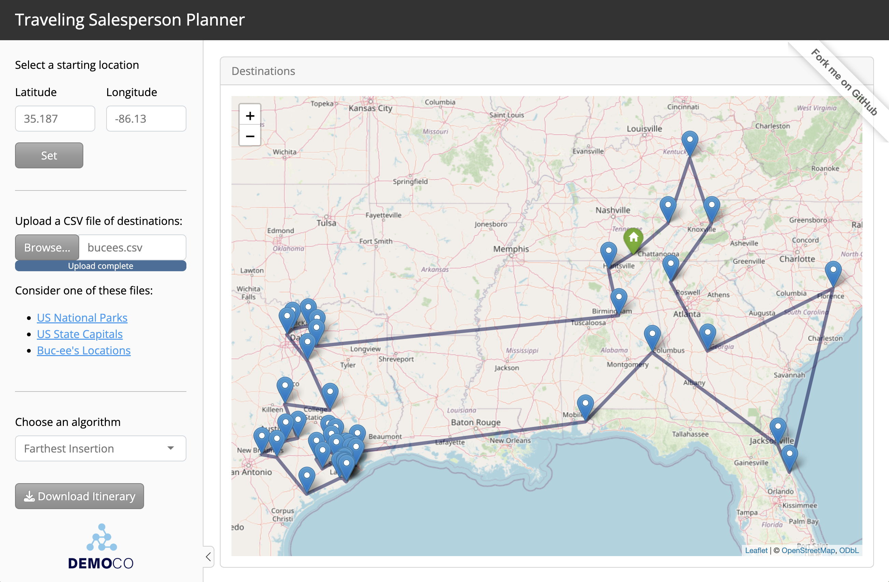
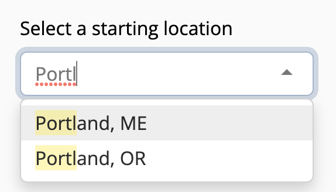
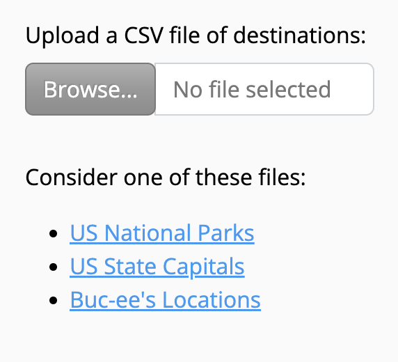
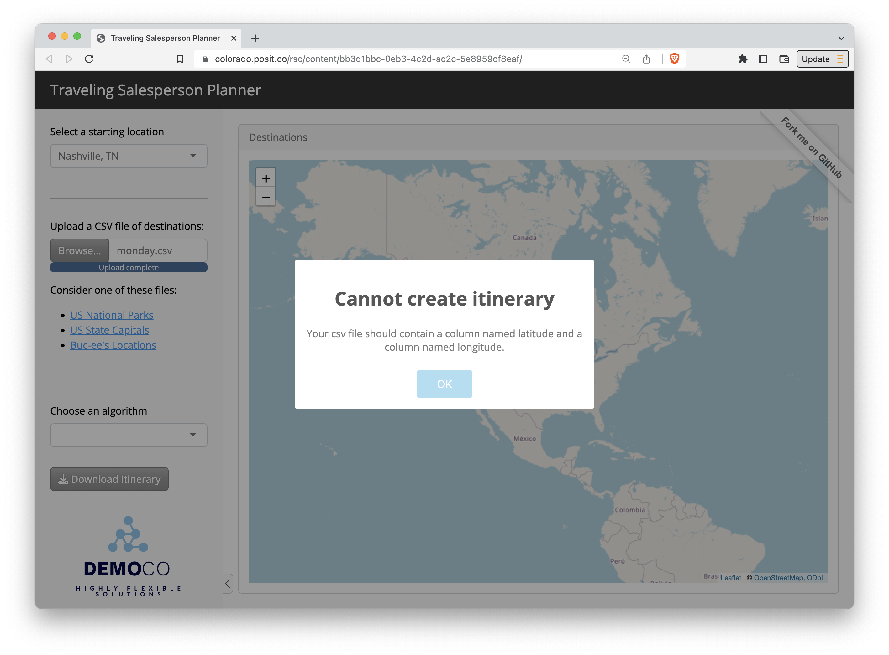
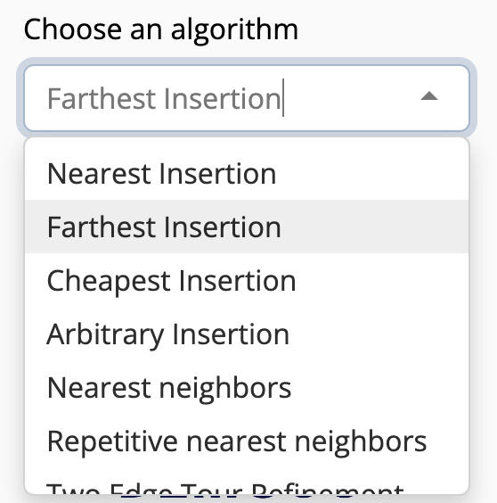

The Traveling Salesperson Planner Shiny app demo lets you upload a file of destinations and download an efficiently ordered itinerary.

- [View the app](https://colorado.posit.co/rsc/content/bb3d1bbc-0eb3-4c2d-ac2c-5e8959cf8eaf/) on Posit Connect
- [Play with the code](https://posit.cloud/content/6708777) on Posit Cloud


## To use the app

To use the app:

1. **Visit the app [here](https://colorado.posit.co/rsc/content/bb3d1bbc-0eb3-4c2d-ac2c-5e8959cf8eaf/).** The app is hosted on [Posit Connect](https://posit.co/products/enterprise/connect/), a hosting platform for data driven content. You can use Posit Connect to publish models, reports, etc. securely within your enterprise; or to deploy data products to your customers and manage access.

2. **Select a starting location**. Type in a city name followed by a state, or choose one from the drop down menu. This will be the location you will begin and end your journey at. The app recognizes 312 major North American cities.

    
    
3. **Upload a .csv file of destinations** to visit. If you do not have a file, you can download one of the three suggested files and then upload it to the app. 

    
    
    The file should contain a table that has a column named `latitude` and a column named `longitude`. Latitude, Lat, lat, Longitude, Long, and long are all acceptable spellings. Other columns are OK, but there should at least be a latitude and longitude column. If your table does not have these columns, the app will return this alert.
    
    
    
4. **Select an algorithm.** There are multiple ways to solve the "Traveling Salesperson Problem." The app will use R's [TSP package](https://github.com/mhahsler/TSP)^[Hahsler M, Hornik K (2007). “TSP - Infrastructure for the traveling salesperson problem.” Journal of Statistical Software, 23(2), 1-21. ISSN 1548-7660, doi:10.18637/jss.v023.i02 https://doi.org/10.18637/jss.v023.i02.] and whatever algorithm you select to order the destinations into a sensible itinerary.

    After you select an algorithm, the app will build an itinerary and display a Download Itinerary button.
    
    
    
    
5. **Click Download Itinerary.** The app will download a new version of your file. This versions reorders the rows in your original file to reflect the order in which you should visit the destinations. It also appends a column named "visit order".

    

# To build a similar app

The Traveling Salesperson Planner app is written in R with the [Shiny]() package. Shiny makes it easy to create an interactive web app with only R code: you do not need to know HTML, CSS, JavaScript, or any web development skills. (Click here to learn about [Shiny for Python](https://shiny.posit.co/py/)).

[This tutorial](https://shiny.posit.co/getstarted.html) explains how to write a basic web app with Shiny. 

There are five unique things about the Traveling Salesperson Planner app:

1. It [uses a theme from the bslib package](https://rstudio.github.io/bslib/articles/theming/index.html) to make the app look more visually appealing.

    ```r
    theme = bs_theme(bootswatch = "spacelab",
                     success ="#86C7ED",
                     base_font = "Open Sans",
                     heading_font = "Open Sans")
    ```

2. It allows the user to upload a file to use as input with a [fileInput widget](https://mastering-shiny.org/action-transfer.html#upload).

    ```r
    fileInput("file", "Upload a CSV file of destinations:")
    ```

3. It checks the user's file and provides a pop alert with the [shinyalert](https://github.com/daattali/shinyalert) package if anything looks amiss.

    ```r
    # helpers.R
    if (!valid) {
      shinyalert("Cannot create itinerary", "Your csv file should contain a column named latitude and a column named longitude.")
    }
    ```

4. It uses an interactive leaflet map to display locations on a map. You can learn more about using leaflet maps in Shiny apps [here](https://rstudio.github.io/leaflet/).

    ```r
    leafletOutput("map")
    ```

5. It allows the user to download the results with a [download button](https://mastering-shiny.org/action-transfer.html#download). This is a button that triggers a download handler.

    ```r
    # Render the download button in the UI if uploaded_data() exists
    output$downloadButtonUI <- renderUI({
      req(uploaded_data())
      downloadButton("downloadData", "Download Itinerary")
    })
    
    # Create a download handler for the uploaded data
    output$downloadData <- downloadHandler(
      filename = function() {
        stub <- str_remove(input$file$name, "\\.csv$")
        paste0(stub, "_itinerary.csv")
      },
      content = function(file) {
        data <- clean_for_download(itinerary())
        write_csv(data, file)
      }
    )
    ```


