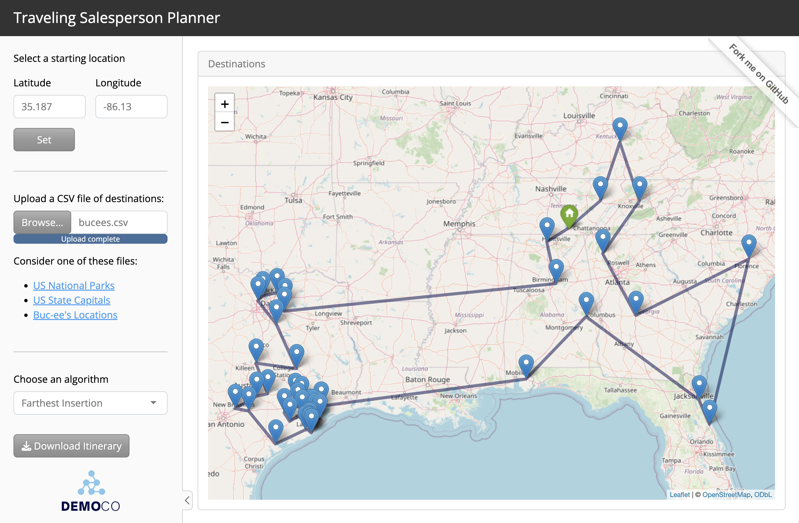
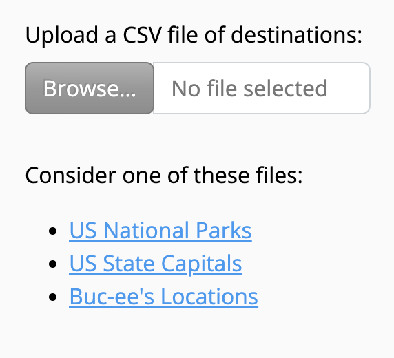
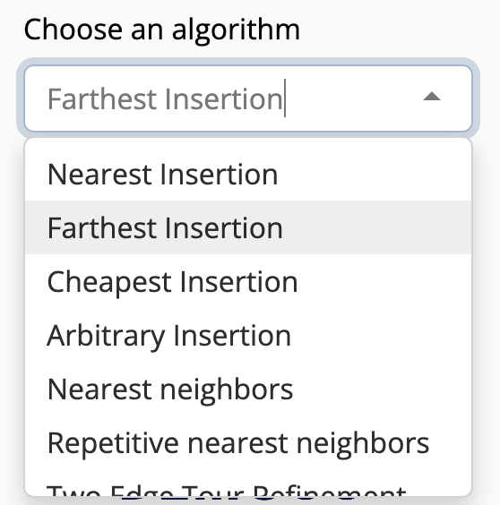

Traveling Salesperson Planner app
================

<figure>

<figcaption aria-hidden="true">“Traveling Salesperson Planner
app”</figcaption>
</figure>

The Traveling Salesperson Planner Shiny app demo lets you upload a file
of destinations and download an efficiently ordered itinerary.

- [View the
  app](https://colorado.posit.co/rsc/content/bb3d1bbc-0eb3-4c2d-ac2c-5e8959cf8eaf/)
  on Posit Connect
- [Play with the code]() on Posit Cloud

## To use the app

To use the app:

1.  **Visit the app
    [here](https://colorado.posit.co/rsc/content/bb3d1bbc-0eb3-4c2d-ac2c-5e8959cf8eaf/).**
    The app is hosted on [Posit
    Connect](https://posit.co/products/enterprise/connect/), a hosting
    platform for data driven content. You can use Posit Connect to
    publish models, reports, etc. securely within your enterprise; or to
    deploy data products to your customers and manage access.

2.  **Select a starting location**. Type in a city name followed by a
    state, or choose one from the drop down menu. This will be the
    location you will begin and end your journey at. The app recognizes
    312 major North American cities.

    <figure>
    
    <figcaption aria-hidden="true">“Select location”</figcaption>
    </figure>

3.  **Upload a .csv file of destinations** to visit. If you do not have
    a file, you can download one of the three suggested files and then
    upload it to the app.

    <figure>
    
    <figcaption aria-hidden="true">“Upload a file of
    destinations”</figcaption>
    </figure>

    The file should contain a table that has a column named `latitude`
    and a column named `longitude`. Latitude, Lat, lat, Longitude, Long,
    and long are all acceptable spellings. Other columns are OK, but
    there should at least be a latitude and longitude column. If your
    table does not have these columns, the app will return this alert.

    <figure>
    
    <figcaption aria-hidden="true">“What the alert looks like”</figcaption>
    </figure>

4.  **Select an algorithm.** There are multiple ways to solve the
    “Traveling Salesperson Problem.” The app will use R’s [TSP
    package](https://github.com/mhahsler/TSP)[^1] and whatever algorithm
    you select to order the destinations into a sensible itinerary.

    After you select an algorithm, the app will build an itinerary and
    display a Download Itinerary button.

    <figure>
    
    <figcaption aria-hidden="true">“Select an algorithm”</figcaption>
    </figure>

5.  **Click Download Itinerary.** The app will download a new version of
    your file. This versions reorders the rows in your original file to
    reflect the order in which you should visit the destinations. It
    also appends a column named “visit order”.

    <figure>
    
    <figcaption aria-hidden="true">“The Download Button”</figcaption>
    </figure>

[^1]: Hahsler M, Hornik K (2007). “TSP - Infrastructure for the
    traveling salesperson problem.” Journal of Statistical Software,
    23(2), 1-21. ISSN 1548-7660, <doi:10.18637/jss.v023.i02>
    <https://doi.org/10.18637/jss.v023.i02>.
